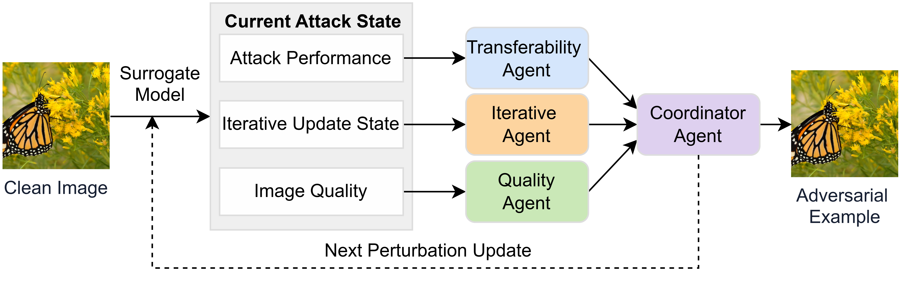

<h1 align="center">Generating Transferable Adversarial Examples via a Multi-Agent Scheduling Framework</h1>

## Framework



## Evaluate Adversarial Examples

We have provided the ViT-B adversarial examples in:

```text
./results/vit_b_agentic_adv
```

Run the following command for evaluation to obtain the same result as reported in the paper:

```bash
python evaluate.py --GPU_ID 0
```

## Code Structure

The main components are organized as follows:

| Component | Code | Description |
|---|---|---|
| Transferability Agent | `transferattack/input_transformation/agent_quality_mdcsops.py` | Schedules `n_op` and `n_nei` for transformation-operator sampling and neighbor sampling. |
| Iterative Agent | `transferattack/input_transformation/agent_quality_mdcsops.py`, `transferattack/input_transformation/mdcsops.py` | Schedules `epsilon`, `alpha`, `gamma`, and `lambda` for the perturbation update. |
| Quality Agent | `transferattack/quality/quality_preserver.py` | Schedules `eta` and projects perturbations with a texture-aware pixel budget. |
| Coordinator Agent | `transferattack/agent/llm_controller.py` | Queries Qwen3.6-Plus and records the fused action `{n_op, n_nei, epsilon, alpha, gamma, lambda, eta}`. |
| Method entry | `transferattack/agentic_schedule.py` | Provides the attack entry used by `generate.py`. |

```text
configs/
  agent_api.json                   Qwen3.6-Plus API configuration template
  attack_vit_b.json                ViT-B generation configuration

data/
  labels.csv                       Image labels for evaluation
  images/                          Clean evaluation images

results/
  vit_b_agentic_adv/               Provided ViT-B adversarial examples

transferattack/
  agentic_schedule.py              Method entry
  agent/                           Coordinator Agent
  input_transformation/            Transferability Agent and Iterative Agent
  quality/                         Quality Agent

generate.py                        Craft adversarial examples
evaluate.py                        Evaluate adversarial examples
evaluate_attack.py                 Attack-success-rate evaluation
evaluate_quality.py                Image-quality evaluation
main.py                            Attack runner
```

## Environment

```bash
conda create -n agentic-transfer python=3.10 -y
conda activate agentic-transfer
pip install -r requirements.txt
```

Install the PyTorch build that matches the local CUDA version before installing the remaining dependencies when GPU evaluation or generation is used.

## Dataset

ImageNet-compatible Dataset from [https://github.com/cleverhans-lab/cleverhans/tree/master/cleverhans_v3.1.0/examples/nips17_adversarial_competition/dataset](https://github.com/cleverhans-lab/cleverhans/tree/master/cleverhans_v3.1.0/examples/nips17_adversarial_competition/dataset). We have downloaded and stored the images in `./data`. Adversarial examples must use the same filenames as `./data/labels.csv`.

## Craft Adversarial Examples

Set the Qwen3.6-Plus API credential:

```bash
export DASHSCOPE_API_KEY=<your_token>
```

Run:

```bash
python generate.py --GPU_ID 0
```
